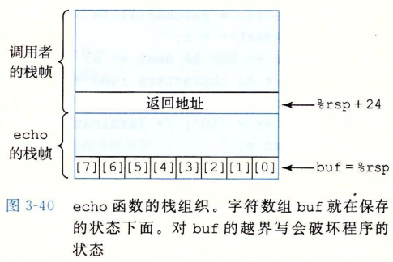
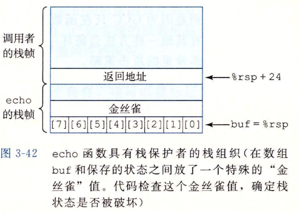
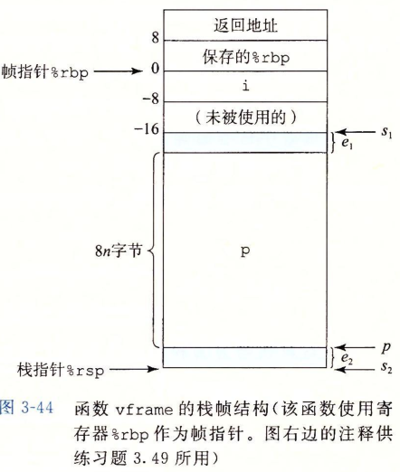

# CSAPP-3.10 在机器级程序中将控制与数据结构结合

## 3.10.3 内存越界引用和缓冲区溢出

栈中分配字符数组来保存字符串，但当字符串长度超出为数组分配的空间，就会发生缓冲区溢出【buffer overflow】。

```c
/* Implementation of library function gets() */
char *gets(char *s)
{
    int c;
    char *dest = s;
    while ((c = getchar()) != '\n' && c != EOF)
        *dest++ = c;
    if (c == EOF && dest == s)
        /* No characters read */
        return NULL;
    *dest++ = '\0';
    return s;
}

/* Read input line and write it back */
void echo()
{
    char buf[8];
    gets(buf);
    pus(buf);
}
```

上述代码汇编如下：

```assembly
echo:
	subq	$24, %rsp
	movq	%rsp, %rdi
	call gets
	movq %rsp, %rdi
	call puts
	addq $24, %rsp
	ret
```

当字符串长度超出分配的数组空间，则会覆盖其他地址；



| 输入的字符数量 | 附加的被破坏的状态 |
| -------------- | ------------------ |
| 0~7            | 无                 |
| 9~23           | 未被使用的栈空间   |
| 24~31          | 返回地址           |
| 32+            | caller中保存的状态 |

第二个情况为什么不是8~23？

### 习题3.46

%rbx的值为01 23 45 67 89 AB CD EF，

输入字符串为“0123456789012345678901234”

字符0\~9的ASCII代码为0x30\~0x39

c代码：

```c
/* This is very low-quality code.
   It is intended to illustrate bad programing pratices.
   See Practice Problem 3.46. */
char *get_line()
{
    char buf[4];
    char *result;
    gets(buf);
    result = malloc(strlen(buf));
    strcpy(result, buf);
    return result;
}
```

对gets调用的反汇编：

```assembly
0000000000400720 <get_line>:
	400720:	53				push	%rbx		# %rbx存放的result入栈
	400721:	48 83 ec 10		sub  	$0x10,%rsp  # 分配当前栈帧
	400725: 48 89 e7		mov		%rsp,%rdi	# 栈指针作为gets参数, 栈指针存放数组buf
	400728: e8 73 ff ff ff	callq	4005a0 <gets>
```


A. 执行了第3行的栈

| 00 00 00 00 00 40 00 76 | 返回地址     |
| ----------------------- | ------------ |
| 01 23 45 67 89 AB CD EF | %rbx         |
|                         |              |
|                         | ← buf = %rsp |
|                         |              |

B.执行第5行调用gets后，25个字节被覆盖

| 00 00 00 00 00 40 00 34 | 返回地址     |
| ----------------------- | ------------ |
| 33 32 31 30 39 38 37 36 | %rbx         |
| 35 34 33 32 31 30 39 38 |              |
| 37 36 35 34 33 32 31 30 | ← buf = %rsp |
|                         |              |


C. 试图返回到 0x040 00 34，低位2字节被字符‘4’和结尾空(null)字符覆盖

D.  %rbx 被破坏, 变成了0x33 32 31 30 39 38 37 36

E.  对malloc的调用应该以 `strlen(buf) + 1`作为参数，而且代码应该检查返回值是否为NULL。

**缓冲区溢出很容易被黑客利用，用来执行程序本来不愿意执行的函数。**

## 3.10.4 对抗缓冲区溢出攻击

- 栈随机化

地址空间布局随机化（Address-Space Layout Randomization, ASLR）的其中一种，ASLR会对程序代码、库代码、栈、全局变量、堆数据都会加载到内存的不同区域，可以产生不同的地址映射。

- 栈破坏检测

 在栈帧中任何局部缓冲区和栈状态之间存储一个哨兵值，在恢复寄存器和从函数返回之前，都会检查哨兵值是否被改变，如果改变了则中止程序。



- 限制可执行代码区域

以前x86体系结构将读和执行访问控制合并成一个1位的标志，任何被标记为可读的页也都是可执行的。栈必须是可读可写的，因此栈上的自己都能执行。现在64位处理器的内存保护可以引入“NX”（No-Execute,不执行）位，可以把栈标记为可读可写，但不可执行。而检查页是否可执行由硬件来完成，效率没有损失。

### 习题3.48 

```c
int len(char *s) {
    return strlen(s);
}

void iptoa(char *s, long *p) {
    long val = *p;
    sprintf(s, "%ld", val);
}

int intlen(long x) {
    long v;
    char buf[12];  // 12字节
    v = x;
    iptoa(buf, &v);
    return len(buf);
}
```

不带栈保护：

```assembly
intlen:
	subq	$40,%rsp   			# 分配栈帧
	movq	%rdi, 24(%rsp)		# x参数入栈
	leaq	24(%rsp),%rsi		# x的地址作为iptoa第二参数
	movq	%rsp, %rdi			# buf作为iptoa第一个参数
	call iptoa
```

带栈保护的汇编：

```assembly
intlen:
	subq	$56, %rsp 			# 分配栈帧
	movq	%fs:40, %rax		# 哨兵值
	movq	%rax, 40(%rsp)		# 哨兵值入栈
	xorl	%eax, %eax			# 0
	movq	%rdi, 8(%rsp)		# x的值放到%rsp+8处
	leaq	8(%rsp), %rsi		# x的地址作为iptoa第二参数
	leaq	16(%rsp), %rdi		# buf作为iptoa第一个参数
	call iptoa
```

A. buf、v、金丝雀（哨兵）值分别在栈帧的什么位置？

无保护intlen代码：

| 存放内容                            | 栈址    |
| ----------------------------------- | ------- |
| 返回地址                            | %rsp+40 |
|                                     | %rsp+32 |
| v                                   | %rsp+24 |
|                                     | %rsp+16 |
| 00 00 00 00 buf\[11]\[10]\[9]\[8]   | %rsp+8  |
| buf\[7]\[6]\[5]\[4]\[3]\[2]\[1]\[0] | %rsp    |

有保护intlen代码：

| 存放内容                            | 栈址    |
| ----------------------------------- | ------- |
| 返回地址                            | %rsp+56 |
|                                     | %rsp+48 |
| 金丝雀值                            | %rsp+40 |
|                                     | %rsp+32 |
| 00 00 00 00 buf\[11]\[10]\[9]\[8]   | %rsp+24 |
| buf\[7]\[6]\[5]\[4]\[3]\[2]\[1]\[0] | %rsp+16 |
| v                                   | %rsp+8  |
|                                     | %rsp    |

B. 在有保护代码中，v比buf更靠近栈顶, buf溢出也不会破坏v的值

## 3.10.5 支持变长栈帧

借助帧指针 %rbp,  （frame pointer, base pointer基指针）

变长数组例子：

```c
long vframe(long n, long idx, long *q) {
    long i;
    long *p[n];
    p[0] = &i;
    for (i = 1; i < n; i++)
        p[i] = q;
    return *p[idx];
}
```

相应的汇编代码：

```c
long vframe(long n, long idx, long *q)
 // n in %rdi,  idx in %rsi,  q in %rdx

 /*
 Code for initialization loop
 i in %rax and on stack, n in %rdi, p in %rcx, q in %rdx */
    
```

```assembly
vframe:
	pushq	%rbp				# 保存上一个帧指针
	movq	%rsp,%rbp			# 将当前栈顶指针设为帧指针
	subq	$16, %rsp			# 分配16字节空间, s1位置
	leaq	22(,%rdi,8), %rax	# 
	andq	$-16, %rax			# -16的二进制为110000
	subq	%rax, %rsp			# 分配数组p的空间，位置s2
	leaq	7(%rsp), %rax		# s2+7
	shrq	$3, %rax			# 逻辑右移3位，即除8
	leaq	0(,%rax,8), %r8 	# 将&p[0]放到%r8寄存器
	movq	%r8, %rcx			# 把&p[0]放到%rcx寄存器
  .L3:
  	movq	%rdx, (%rcx,%rax,8) # set p[i] to q
  	addq	$1, %rax 			# i++
  	movq	%rax, -8(%rbp)		# i存到栈%rbp-8处
  .L2:
  	movq	-8(%rbp), %rax		# 取出i的值
  	cmpq	%rdi, %rax			# 比较i,n
  	jl		.L3					# if <, goto loop
  	leave						# 恢复栈指针为上一个帧指针
  	ret
```

leave指令等价于：

```assembly
movq	%rbp, %rsp		# 恢复栈指针为上一个帧指针，即清空当前栈帧
popq	%rbp			# 弹出栈内%rbp的值
```



### 习题3.49

**A. 5~7行是如何计算s2的？**

立即数\$-16的二进制为11 0000，与操作可以把低4位置0，而%rax 为 22+8n

| n    | 22+8n的16进制 | andq	$-16, %rax的值 |
| ---- | ------------- | ---------------------- |
| 0    | 0x16          | 0x10                   |
| 1    | 0x1E          | 0x10                   |
| 2    | 0x26          | 0x20                   |
| 3    | 0x2E          | 0x20                   |
| 4    | ...           |                        |

如此一来，对于偶数n，%rax结果为8n+16; 对于奇数n，%rax为8n+8。

s1-%rax的值即s2

**B. 解释8~10行中计算p的逻辑**

保证s2舍入到最近的8的倍数。

**C. 对于下面n和s1的值, 确定s2、p、e1、e2的值**

| n    | s1       | s2   | p    | e1   | e2   |
| ---- | -------- | ---- | ---- | ---- | ---- |
| 5    | ==2065== | 2017 | 2024 | 1    | 7    |
| 6    | ==2064== | 2000 | 200  | 16   | 0    |

n=5时，2065-8*5-8=2017

2024 / 8 = 253   s2=2024

e2 = 2024-2017 = 7

e1 = 2065 - (2024+5*8) = 1

n=6时，2064-8*6-16=2000

（2000+7）/8=250.875  s2=250*8=2000

e1 = 2064-(2000+6*8)=16

e2 = 2000-2000 = 0

**D. 代码为s2和p的值提供了什么样的对齐属性？**

s2会保留s1的偏移量为最接近的16的倍数；p以8的倍数对齐
