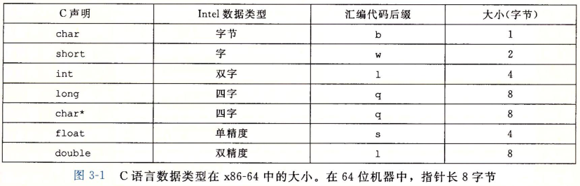
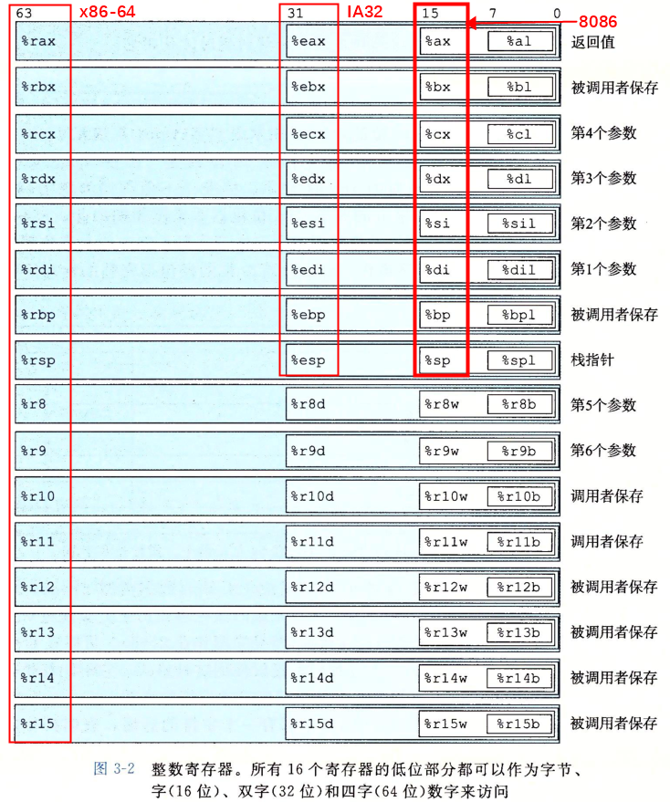
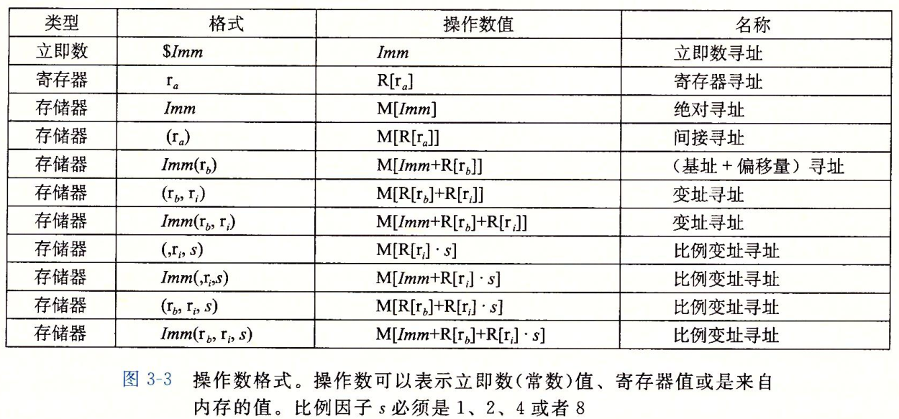
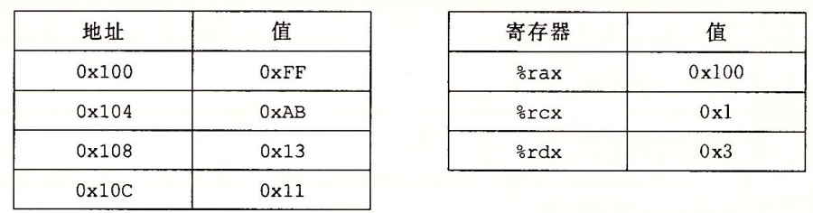

# CSAPP-3.4 访问信息

## 3.3 数据格式



数据传送指令：

1. movb 传送字节byte=8位
2. movw 传送字word=2字节=16位
3. movl 传送长字 双字=4字节=32位
4. movq 传送四字=8字节=64位

浮点数使用的指令和寄存器和整数使用的完全不同

## 3.4 访问信息

整数寄存器：



%rsp 栈指针寄存器   %rax 返回值

以寄存器为目标，复制和生成小于8字节结果的指令，寄存器剩下的字节：

1. 生成1和2字节的指令会保持剩下指令不变
2. 生成4字节数字的指令会把高位4字节置0

### 3.4.1 操作数指示符

三种类型：

1. 立即数 Immediate  - 表示常数值 例如 \$-577表示-577  \$0x1F表示0x1F
2. 寄存器 Register - 表示寄存器内容  $r_a$表示任意寄存器, 其值为$R[r_a]$
3. 内存引用 - 根据地址访问内存 M[Addr]

常用语法：

$Imm(r_b, r_i, s)$表示立即数偏移，基址寄存器$r_b$（64位），变址寄存器$r_i$（64位），比例因子s（s必须是1、2、4或8），有效地址为$Imm+R[r_b]+R[r_i]·s$。



操作数%rax的值就是%rax寄存器的值，

习题：已知寄存器和地址的值，操作数值如下：




### 3.4.2 数据传送指令

#### 指令类——MOV类


S:立即数、寄存器中的立即数、内存中的立即数

D:寄存器、内存地址

x86-64限制：不能直接从内存位置传送数据到内存位置

movabsq：只能传送到寄存器，能够以任意64位立即数作为源操作数，而movq只能以表示为32为补码数字的立即数作为源操作数

**习题3.2**

将内存的值放到寄存器，或将寄存器的值放到内存。根据寄存器的字长决定指令。


#### MOVZ类

较小的源复制到较大的目的，需要扩展高位

Z-zero 零扩展


#### MOVS类

S-sign 符号扩展


**习题3.3**


| 原命令               | 讲解                                                         |
| -------------------- | ------------------------------------------------------------ |
| movb \$0xF, (%ebx)   | 内存引用的寄存器必须是四个字的，改成movb $0xF, (%rbx)        |
| movl %rax, (%rsp)    | %rax是四个字而l代表两个字，改成movl %eax, (%rsp) 或者 movq %rax, (%rsp) |
| movw (%rax), 4(%rsp) | 两个操作数不能都是内存引用                                   |
| movb %al, %sl        | 没有寄存器名字叫%sl                                          |
| movq %rax,$0x123     | dest不能作为des操作数                                        |
| movl %eax, %rdx      | 原答案为destination operand incorrect size，改成movl %eax, %edx<br>原书P123第一行，寄存器部分的大小必须与指令最后一个字符指定的大小匹配 |
| movb %si, 8(%rbp)    | %si是一个字而b代表一个字节，改成movb %sil, 8(%rbp) 或者 movw %si, 8(%rbp) |


### 汇编命令总结

1）%eax，%dx就是寄存器的名字

2）(%rax)。只要是有括号的了，那就是内存引用。注意x86-64中的内存引用总是用四字长寄存器给出的，即寄存器名字开头都是r开头的。(%rax)意思是取寄存器%rax中的存的地址中的存的值，相当于解引用两次，先解引用寄存器，再解引用这地址（我用“解引用”这个词只是为了方便理解）。

3）mov命令中，两个操作数只允许有一个内存引用，即只能有一个带括号的。

4）关于mov命令的后缀，肯定与内存引用中的寄存器的长度无关，而是与另一个寄存器的长度有关

5）b代表1个字节；w代表1个字，2个字节；l代表2个字，4个字节；q代表4个字，8个字节。


### 3.4.3 数据传送示例

**练习题3.4** 

```c
typedef long src_t;
typedef long dest_t;

int copy(){src_t *sp, dest_t *dp){
    // sp in %rdi,   dp in %rsi
    *dp = (dest_t) *sp;
    return 0;
}

```


| src_t             | dest_t              | 指令                                          | 讲解                                                         |
| ----------------- | ------------------- | --------------------------------------------- | ------------------------------------------------------------ |
| long 8            | long 8              | movq (%rdi), %rax<br>movq %rax, (%rsi)        |                                                              |
| char  1           | int 4               | movsbl (%rdi), %eax<br>movl %eax, (%rsi)      | 源和目的是有符号的，所以s；因为从char到int，所以是bl；       |
| char              | unsigned            | movsbl (%rdi), %eax<br/>movl %eax, (%rsi)     | 2.2.6章节，当强制类型转换既涉及大小又涉及C中符号变化，操作应先改变大小；所以先改变有符号的大小 |
| ==unsigned char== | ==long==            | ==movzbl (%rdi), %eax<br/>movq %rax, (%rsi)== | 因为源无符号所以用z。但第一条指令的目的是2个字的，使用l和%eax。<br>之所以不直接复制到4个字；是因为复制2个字效率更高，还能利用x86-64复制4字节的特性将高位置0 |
| ==int 4==         | ==char 1==          | ==movl (%rdi), %eax<br/>movb %al, (%rsi)==    | 从大到小，先直接全部读，然后再按照目标类型大小截断即可       |
| ==unsigned 4==    | ==unsigned char 1== | ==movl (%rdi), %eax<br/>movb %al, (%rsi)==    | 和上面一样，源有无符号根本无所谓                             |
| char 1            | short 2             | movsbw (%rdi), %ax<br/>movw %ax, (%rsi)       |                                                              |

关于第四个movzbl和movzbq的争议：https://www.zhihu.com/question/291651098

### 3.4.4 压入和弹出栈数据


%rsp 的值总是栈顶的地址