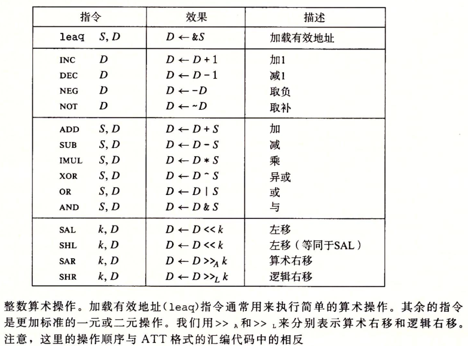

# CSAPP-3.5 算术和逻辑操作

## 3.5 算术和逻辑操作

四组指令:

- 加载有效地址
- 一元操作
- 二元操作
- 移位

只有leaq指令没有其他变种，其他指令都带有不同大小操作数的变种，例如：

$addb、addw、addl、addq$

## 3.5.1加载有效地址

load effective address指令leaq，将有效地址写入到目的操作数（必须是一个寄存器），而没有用到内存引用。

例：%rax寄存器值为x，%rcx寄存器值为y，

$leaq\ 6(\%rax), \%rdx$  %rdx的值为6+x

## 3.5.2 一元&二元操作符

一元操作：操作对象可以是内存位置、也可是寄存器。例：指令$incq\ (\%rsp)$ 会使栈顶的8字元素加1。

二元操作：$subq\ \%rax, \%rdx$ 使寄存器%rdx的值减去%rax的值。$sub\ S\ D$ , S可以是立即数、寄存器、内存位置，D为寄存器或内存位置，D既是源又是目的。当第二个操作数为内存地址时，处理器必须从内存中读出值，执行操作，再把结果协会内存。

## 3.5.3 移位

指令$SAL\ k\ D$, k为移位量，D为要移位的数。k可以是立即数，或者放在单字节寄存器%cl中，

SAL和SHL都是逻辑左移，即右边填0

SAR-算术右移，填上符号位， $>>_A$

SHR-逻辑右移，填上0,$>>_L$

目的操作数可以是寄存器或内存位置。

如果移位操作对w位长的数据，那么移位量就是%cl中的低m位的无符号数值（它们的关系是2 m = w 2^m=w2 
m
 =w）。
以%cl的十六进制值为0xFF为例：

| 命令 | 等式   | 有效位 | 移位量    |
| ---- | ------ | ------ | --------- |
| salb | 2^3=8  |        | 111=7     |
| salw | 2^4=16 |        | 1111=15   |
| sall | 2^5=32 |        | 11111=31  |
| salq | 2^6=64 |        | 111111=63 |

## 3.5.5 特殊的算术运算

128位运算，用%rdx和%rax存储高64低64位

对于大多数64位除法应用来说，除数也常常是64位的值，这个值应该存放在%rax中，%rdx的位应该设置为全0（无符号运算）
或%rax的符号位（有符号运算），后者操作可以用指令cqto来完成。

