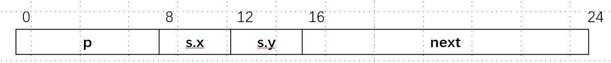

# CSAPP-3.9 异质的数据结构

## 3.9.1 struct

### 习题3.41

```c
struct prob {
    int *p;
    struct {
        int x;
        int y;
    } s;
    struct prob *next;
};


/* _ 为省略的表达式  */
void sp_init(struct prob *sp) {
    sp->s.x = ____;
    sp->p = ____;
    sp->next = ____;
}

```


A.字段偏移量

| 偏移 | 0    | 8    | 12   | 16   | 24   |
| ---- | ---- | ---- | ---- | ---- | ---- |
| 字段 | p    | s.x  | s.y  | next |      |



B.struct prob总共需要多少字节？

24字节

C.汇编代码如下，填写缺失表达式

```assembly
void sp_init(struct prob *sp)
sp in %rdi
sp_init:
  movl    12(%rdi), %eax
  movl    %eax, 8(%rdi)
  leaq    8(%rdi), %rax
  movq    %rax, (%rdi)
  movq    %rdi, 16(%rdi)
  ret
```

```c
/* _ 为省略的表达式  */
void sp_init(struct prob *sp) {
    sp->s.x = sp->s.y;
    sp->p = &(sp->s.x);
    sp->next = sp;
}
```

### 习题3.42

```assembly
long fun(struct ELE *ptr)
ptr in %rdi
fun:
  movl    $0, %eax
  jmp     .L2
.L3:
  addq    (%rdi), %rax
  movq    8(%rdi), %rdi
.L2:
  testq    %rdi, %rdi
  jne      .L3
  rep;ret
```

逆向工程

```c
struct ELE {
    long v;
    struct ELE *p;
}

long fun(struct ELE *ptr) {
    long a=0;
    while (ptr) {
        a += ptr->v;
        ptr = ptr->p;
    }
    return a;
}
```

## 3.9.2 Union

### 习题3.43

```c
typedef union {
    struct {
        long u;  // 8字节
        short v;  // 2字节
        char w;  // 1字节
    } t1;
    struct {
        int a[2];  // 8字节
        char *p;  // 8字节
    } t2;
} u_type;   /* 16字节 */

void get(u_type *up, type *dest) {
    /* up in %rdi, dest in %rsi */
    *dest = expr;
}
```

根据不同expr和type，用1~3条指令序列计算表达式，并将结果存储到dest。

| expr               | type   | 代码                                                         |
| ------------------ | ------ | ------------------------------------------------------------ |
| up->t1.u           | long   | movq (%rdi), %rax<br />movq %rax, (%rsi)                     |
| up->t1.v           | short  | movw 8(%rdi), %ax<br />movw %ax, (%rsi)                      |
| &up->t1.w          | \*char | addq $10, %rdi<br />movq %rdi, (%rsi)                        |
| up->t2.a           | \*int  | movq %rdi, %rsi                                              |
| up->t2.a[up->t1.u] | int    | movq (%rdi), %rax<br />movl (%rdi,%rax,4), %eax<br />movl %eax, (%rsi) |
| \*up->t2.p         | char   | movq 8(%rdi), %rax<br />movb (%rax), %al<br />movb %al, (%rsi) |

## 3.9.3 数据对齐

习题3.44 struct P5的对齐不是很明白具体的存放位置


