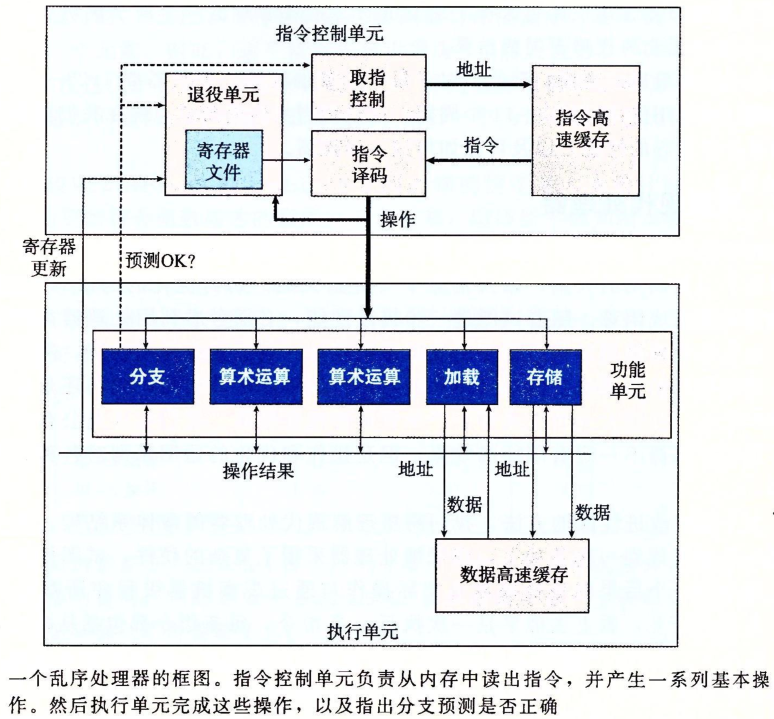
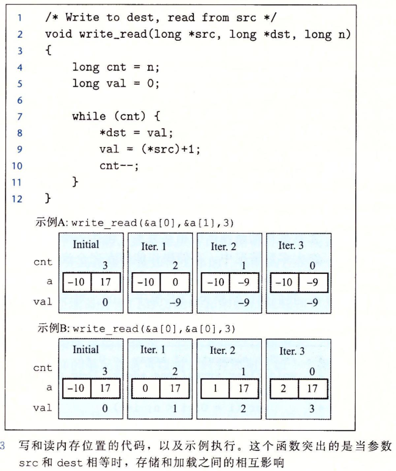

# chapter 5 优化程序性能

## 5.7 理解现代处理器

延迟界限：当一些列操作必须严格按照顺序执行，则会遇到延迟界限

吞吐量界限：刻画了处理器功能单元的原始计算能力，程序性能的终极限制



循环展开和并行累积在多个值中，是提高程序性能的更可靠的办法。

## 5.11 限制因素

### 5.11.1 寄存器溢出

循环并行性的并行度超过可用寄存器数量，则会调用栈来保存变量，反而降低速度

### 5.11.2 分支预测和预测错误处罚

预测错误带来的处罚可能高达很多个周期，可以书写适合用条件传送实现的代码

例：

```c
void minmax1(long a[], long b[], long n){
    long i;
    for (i = 0; i < n; i++){
        if (a[i] > b[i]){
            long t = a[i];
            a[i] = b[i];
            b[i] = t;
        }
    }
}
```

在随机数上测试，CPE为13.5，对于可预测的数据，CPE为2.5~3.5，预测错误惩罚为20个周期，

改写：

```c
void minmax2(long a[], long b[], long n) {
    long i;
    for (i = 0; i < n; i++) {
        long min = a[i] < b[i] ? a[i]:b[i];
        long max = a[i] < b[i] ? b[i]:a[i];
        a[i] = min;
        b[i] = max;
    }
}
```

CPE为4

## 5.12 理解内存性能

### 5.12.1 加载的性能


### 5.12.2 存储的性能

存储本身不影响性能，但写读相关时，则会降低性能. 下例中示例A 的CPE=1.3，示例B的CPE=7.3



## 5.13  性能提高技术

1）高级设计。选择适当的算法和数据结构。

2）基本编码原则。避免限制优化的因素。

- 消除连续的函数调用。尽可能将计算移到循环外。有选择地妥协程序地模块性以获得更大地效率。
- 消除不必要的内存引用。引入临时变量来保存中间结果。只有在最后的值计算出来，才将结果放到数组或全局变量中。

3）低级优化。结构化代码以利用硬件功能。

- 展开循环，降低开销。
- 使用多个累积变量或重新结合等技术，提高指令级并行
- 用功能性地风格 重写条件操作，使得编译采用条件数据传送。
